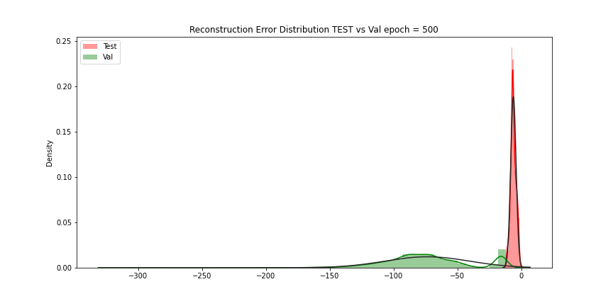
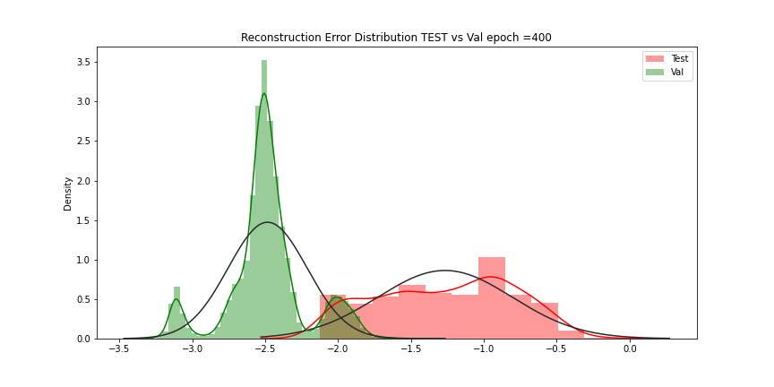

## Fraud Detection Overview

Credit Card Fraud Detection with Machine Learning is a process of data investigation by a Data Science team and the development of a model that will provide the best results in revealing and preventing fraudulent transactions. 
We will use various predictive models to see how accurate they are in detecting whether a transaction is a normal payment or a fraud.

   

## Goals
Create a Neural Network and compare the accuracy to our best classifier.
Understand common mistakes made with imbalanced datasets.

## Model Used
Autoencoders:
The aim of an autoencoder is to learn a lower-dimensional representation (encoding) for a higher-dimensional data, typically for dimensionality reduction, by training the network to capture the most important parts of the inputs.

   

## Distribution of Fraud vs Non-Fraud

